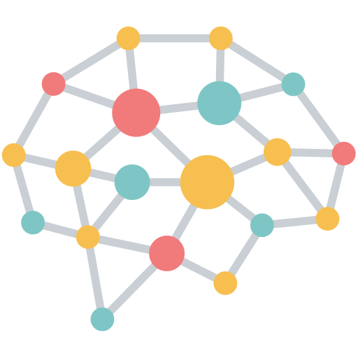
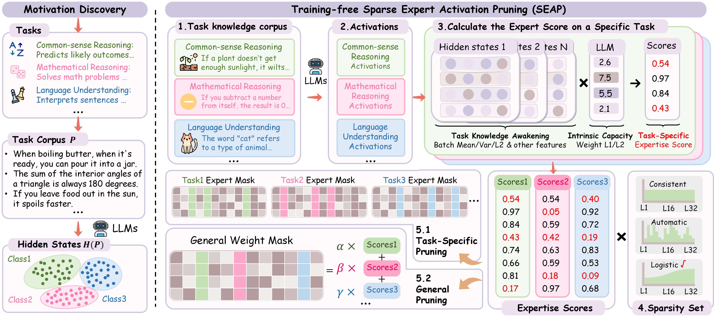
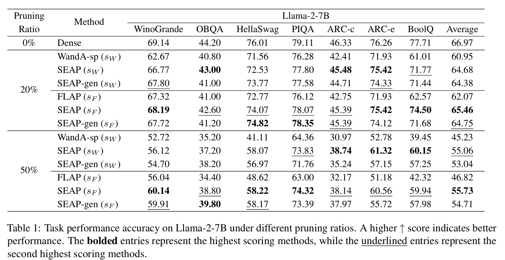
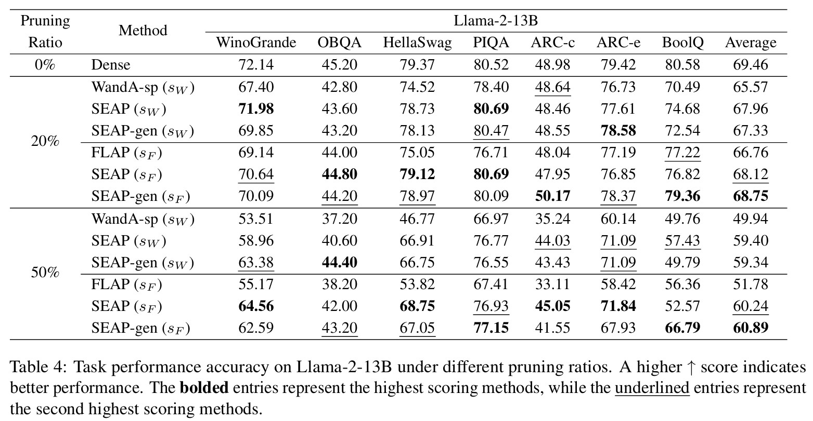
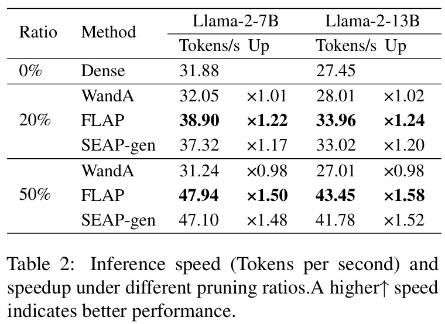
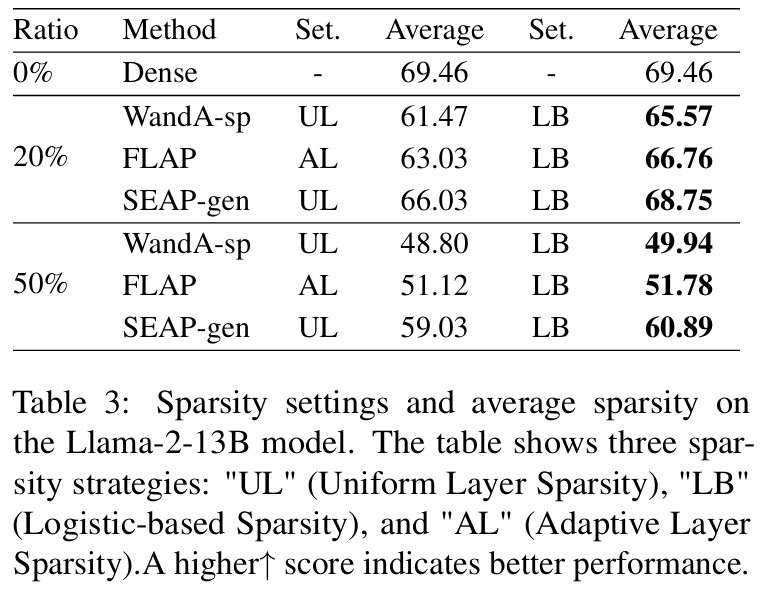

<div align="center"><h2>
SEAP: Training-free Sparse Expert Activation Pruning Unlock the Brainpower of Large Language Models</h2></div>

<p align="center">
    <!-- arXiv badge with a more vibrant academic red -->
    <a href="https://arxiv.org/abs/2503.07605">
        
    </a>
    <!-- Github badge with clean dark color -->
    <a href="https://github.com/IAAR-Shanghai/SEAP">
        
    </a>
</p>

> \[!IMPORTANT\]  
> 🌟 **If you appreciate our work and are interested in the sparsification of large language models, please give us a star! We truly appreciate your support!**

## :loudspeaker: News
- **[2025/03]** We released SEAP: Training-free Sparse Expert Activation Pruning Unlock the Brainpower of Large Language Models. Check out the [paper](https://arxiv.org/abs/2503.11874).

## Overview


<details><summary>Abstract</summary>
Large Language Models (LLMs) have achieved remarkable success but suffer from high computational costs during inference. This paper introduces Sparse Expert Activation Pruning (SEAP), a training-free method that selectively retains task-relevant parameters to reduce overhead. Inspired by clustering patterns in LLM activations, SEAP prunes the model while preserving task performance and improving efficiency. Experimental results show that at 50% pruning, SEAP outperforms WandA and FLAP by over 20%, and at 20% pruning, it only incurs a 2.2% performance drop. These findings demonstrate SEAP's scalability and effectiveness for optimizing LLMs.
</details>

We summarize our primary contributions as follows:

- We analyze task-specific activation patterns in LLMs, revealing their correlation with hidden state distributions and providing new insights for adaptive sparsification.

- We propose SEAP, a training-free, task-adaptive pruning method that dynamically adjusts sparsity based on task type, improving efficiency while preserving performance.
- We demonstrate that SEAP outperforms existing baselines in task accuracy, storage efficiency, and inference speed, confirming its effectiveness for efficient LLM deployment.


## Quick Start

1. Install dependencies:
   ```bash
   pip install -r requirements.txt
   ```
2. Make the script executable:
   ```bash
   chmod +x quick_start.sh
   ```
3. Run the script:
   ```bash
   ./quick_start.sh
   ```
These three steps will automatically execute data preparation, model computation, pruning, and evaluation.

### Project Structure

<details>
<summary>Click to expand project structure</summary>

```bash
.
├── README.md                      # Project overview and setup instructions
├── data                            # Folder containing raw and processed data
│   ├── processed                  # Processed data ready for use
│   └── raw                        # Raw data before processing
├── evaluate_multiple_tasks.py     # Script for evaluating model on multiple tasks
├── evaluate_ppl.py                # Script for evaluating model's perplexity
├── generate.py                    # Script for generating results or outputs
├── notebook                        # Jupyter notebooks for analysis and exploration
│   ├── 0_analysis.ipynb           # Initial exploratory analysis of the data
│   ├── 1_data_exploration.ipynb   # Data exploration and visualization
│   ├── 2_hidden_state_analysis.ipynb # Analysis of hidden states in the model
│   ├── 3_activation_importance.ipynb # Exploring the importance of activations
│   └── 4_classifier.ipynb         # Building and evaluating a classifier
├── quick_start.sh                 # Shell script to quickly set up and run the pipeline
├── requirements.txt               # List of Python dependencies required for the project
├── scripts                         # Python scripts for the main pipeline
│   ├── apply_pruning.py           # Script for applying pruning to the model
│   ├── compute_activations.py     # Script for computing activations from the model
│   ├── compute_masks.py           # Script for computing pruning masks
│   └── data_preparation.py        # Script for preparing the data
└── src                             # Source code for custom models or utilities
```

</details>

### Detailed Step-by-Step Implementation

This guide provides a streamlined approach to applying Sparse Expert Activation Pruning (SEAP) to your model.

### 1️⃣ Data Preparation  

<details>
<summary>Prepare and process the raw data</summary>

```bash
python scripts/data_preparation.py \
 --raw_data_dir data/raw \
 --processed_data_dir data/processed
```

- Converts raw data into a processed format.

</details>

### 2️⃣ Compute Activations  

<details>
<summary>Compute activations for pruning</summary>

```bash
python scripts/compute_activations.py \
  --data_dir ./data/processed \
  --model_root_path ../models \
  --model_name Llama-2-7b-hf \
  --activations_root_path ./activations
```

- Extracts model activations to enable pruning.

</details>

### 3️⃣ Compute Pruning Masks  

<details>
<summary>Generate pruning masks based on activations</summary>

```bash
python scripts/compute_masks.py \
  --model_root_path ../models \
  --model_name Llama-2-7b-hf \
  --activations_root_path ./activations \
  --output_dir ./pruning_masks \
  --pruning_ratio 0.2 \
  --use_generic_mask
```

- Generates pruning masks for the model.

</details>

### 4️⃣ Apply Pruning  

<details>
<summary>Apply pruning using generated masks</summary>

```bash
python scripts/apply_pruning.py \
  --model_root_path ../models \
  --model_name Llama-2-7b-hf \
  --masks_root_dir ./pruning_masks \
  --task_types gsm8k \
  --output_dir ./pruned_models \
  --softmask \
  --pruning_ratio 0.2 \
  --activations_root_path ./activations
```

- Prunes the model with the computed masks.

</details>

### 5️⃣ Evaluate Pruned Model  

<details>
<summary>Evaluate model performance after pruning</summary>

```bash
python evaluate_multiple_tasks.py \
    --model_root_path ../models \
    --model_name Llama-2-7b-hf \
    --pruning_indices_root_dir ./pruning_masks \
    --pruning_ratio 0.2 \
    --temp_dir ./pruned_models \
    --output_base_dir ./eval_out \
    --softmask \
    --use_generic_mask
```

- Assesses the pruned model's performance.

</details>


That's it! You’ve optimized your LLM using SEAP. 🚀


## Results  

- We evaluated SEAP's zero-shot performance across various benchmarks, demonstrating its ability to effectively reduce computational overhead while maintaining competitive accuracy. For Llama-2-7B, SEAP outperformed both WandA and FLAP, with only a 2.2% performance drop at 20% pruning and over 20% improvement at 50% pruning. Interestingly, results varied based on task nature, with general models outperforming expert models on some tasks due to richer knowledge corpora.

<div style="display: flex; flex-direction: column; gap: 20px; justify-content: center; margin-bottom: 20px;">
    
    
</div>

- Regarding inference speed, SEAP significantly improves speed over non-structured pruning methods, completing pruning in 5–10 minutes on a single GPU. At higher pruning rates, SEAP maintains high speed with minimal differences compared to FLAP.

- We compared different sparsity settings (LB, UL, and AL), and our Logistic-based (LB) setting consistently outperformed other strategies, showing more efficient resource allocation and better performance at both 20% and 50% pruning.

<div style="display: flex; gap: 10px; justify-content: center;">
    
    
</div>

