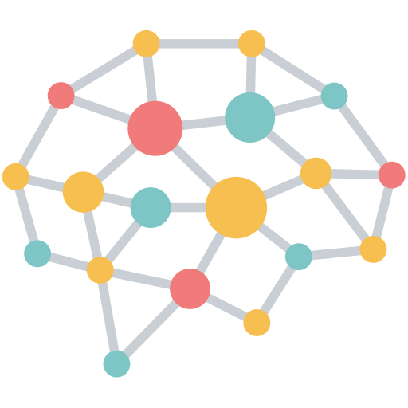
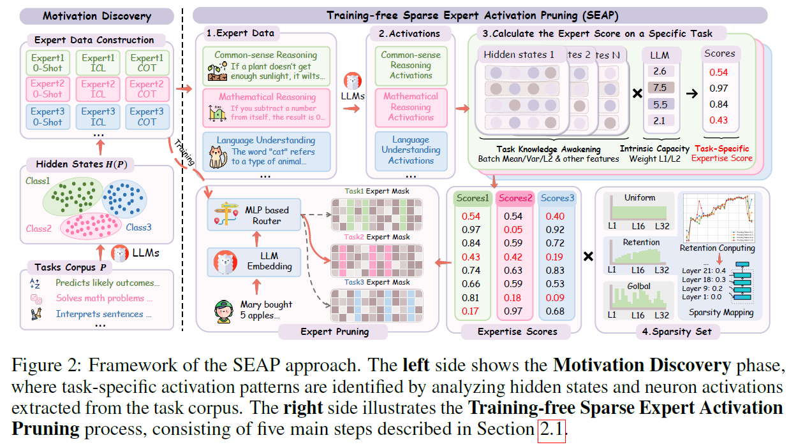
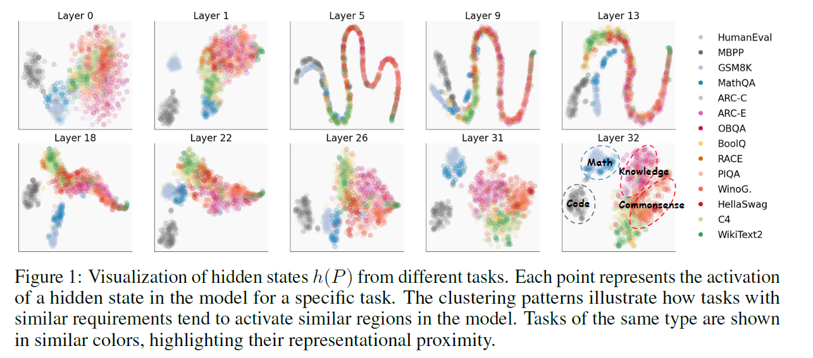
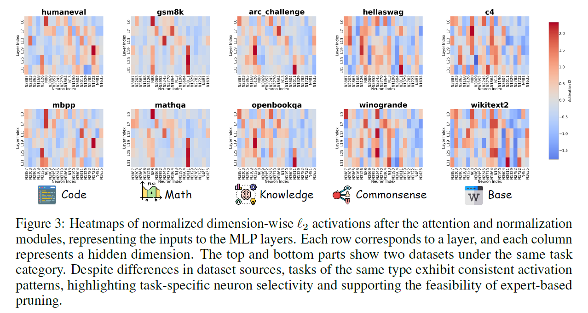
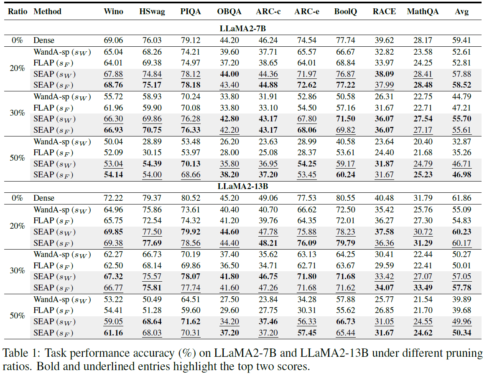
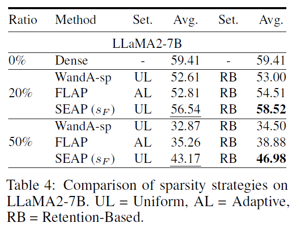
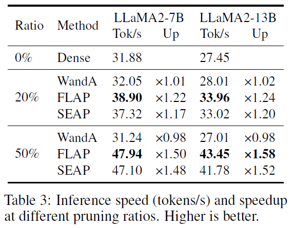

# SEAP: Training-free Sparse Expert Activation Pruning

<div align="center">
  
</div>

SEAP (Sparse Expert Activation Pruning) is a **training-free pruning method** for large language models that preserves task-specific performance while reducing model size and computation. This repository contains full implementations for data processing, activation extraction, pruning strategies, and evaluation.

<div align="center">
  
</div>

---

## 📁 Project Structure

```bash
SEAP/
├── assets/                # Visuals for documentation and results
├── data/                 # Raw task datasets
│   └── raw/
├── eval_summary.xlsx     # Summary of evaluation results
├── evaluate_ppl.py       # Perplexity evaluation script
├── evaluate_tasks.py     # Task-specific evaluation
├── examples/             # Example outputs or templates
├── generate.py           # Generation script (optional usage)
├── layer_importance/     # Layer importance analysis (per model)
├── notebook/             # Exploratory notebooks
├── requirements.txt      # Python dependencies
├── run_matrix_eval.py    # Parallel evaluation runner
├── scripts/              # Pipeline scripts
│   ├── apply_pruning.py
│   ├── compute_activations.py
│   ├── compute_masks.py
│   ├── process_dataset.py
│   └── prune_model.py
└── src/                  # Source code
    ├── activations.py
    ├── analysis_utils.py
    ├── classifier_utils.py
    ├── data_preparation/
    ├── model_utils.py
    ├── pruning_utils/
    ├── remove_test.py
    └── visualization.py
```

---

## 🔧 Installation

```bash
git clone https://github.com/IAAR-Shanghai/SEAP.git
cd SEAP
pip install -r requirements.txt
```

---

## 🧪 Usage

Below is the recommended end-to-end workflow.  Step 4 (evaluation) can be run independently once Steps 1–3 have finished.

---

### Step 1: Preprocess Data

#### Preprocess datasets

```bash
python scripts/process_dataset.py \
  --raw_data_dir data/raw \
  --output_path data/processed/prompts.parquet \
  --generate_base \
  --subset_split train
```

#### Generate expert-specific prompts

```bash
python scripts/expert_data.py \
  --data_path ./data/processed/prompts.parquet \
  --output_dir ./data/experts \
  --samples_per_expert 128
```

---

### Step 2: Compute Activations

#### For expert prompts

```bash
python scripts/compute_activations.py \
  --model_root_path /path/to/models \
  --model_name Llama-2-7b-hf \
  --data_path ./data/experts/prompts.parquet \
  --activations_root_path ./activations \
  --prompt_types experts \
  --sample_size 128
```

#### For evaluation tasks

```bash
python scripts/compute_activations.py \
  --model_root_path /path/to/models \
  --model_name Llama-2-7b-hf \
  --activations_root_path ./activations \
  --prompt_types knowledge \
  --sample_size 128 \
  --tasks mbpp humaneval gsm8k mathqa arc_easy arc_challenge \
          openbookqa winogrande piqa hellaswag boolq race
```

<div align="center">
  
  
</div>

---

### Step 3: Run Model Pruning

```bash
python scripts/prune_model.py \
  --model_root_path /path/to/models \
  --model_name Llama-2-7b-hf \
  --prompt_types knowledge zero_shot \
  --tasks gsm8k mathqa arc_easy arc_challenge \
  --method WIFV \
  --sparsity_strategy retention \
  --pruning_ratio 0.2
```

**Key arguments**:

* `--model_name`: Model to prune
* `--prompt_types`: Prompt styles (`zero_shot`, `cot`, `icl`, `knowledge`, `experts`)
* `--tasks`: Benchmark tasks
* `--method`: Pruning method (`WIFV` or `WIFN`)
* `--sparsity_strategy`: Pruning strategy (`uniform`, `global`, `retention`, etc.)
* `--pruning_ratio`: Percentage of expert heads to prune

---

### Step 4: Evaluate Pruned Models

After completing Steps 1-2, you can evaluate the pruned models using either single-task or matrix evaluation mode.

#### Single Task Evaluation

For evaluating specific model-task combinations:

```bash
python evaluate_tasks.py \
  --model_root_path /path/to/models \
  --model_name Llama-2-7b-hf \
  --activations_root_path ./activations \
  --prompt_types knowledge \
  --task_types gsm8k mathqa arc_easy arc_challenge \
              openbookqa winogrande piqa hellaswag \
  --calibration_task wikitext2 \
  --method WIFV \
  --sparsity_strategy retention \
  --pruning_ratio 0.2
```

**Key arguments**:
* `--prompt_types`: Type of prompts to evaluate (`zero_shot`, `experts`, etc.)
* `--task_types`: List of downstream tasks for evaluation
* `--calibration_task`: Task used for calibration
* `--sparsity_strategy`: Strategy for pruning (`uniform`, `global`, `cosine`, `retention`, etc.)
* `--protect_head/--protect_tail`: Number of layers to protect from pruning
* `--hardmask`: Use hard masking instead of soft masking
* `--temp_dir`: Directory for temporary model files
* `--keep_temp`: Keep temporary files after evaluation

#### Matrix Evaluation

For comprehensive evaluation across models, methods and tasks:

```bash
python run_matrix_eval.py \
  --num_threads 4 \
  --model_root_path /path/to/models \
  --activations_root_path ./activations \
  --output_base_dir ./eval_out
```

This will automatically evaluate combinations of:
- Models: Llama-2-7b-hf, Llama-2-13b-hf
- Methods: WIFV, WIFN  
- Pruning ratios: 0.2, 0.3, 0.5
- Task groups:
  ```python
  {
      "code_gen":       ["humaneval", "mbpp"],
      "math_reasoning": ["gsm8k", "mathqa"],
      "comparison":     ["boolq", "race"],
      "knowledge_qa":   ["arc_challenge", "arc_easy", "openbookqa"],
      "commonsense":    ["piqa", "winogrande", "hellaswag"]
  }
  ```
- Calibration tasks: wikitext2, c4

Results will be saved in timestamped directories under `eval_out/` with detailed logs and a JSON summary.

---

## 🧠 Supported Task Groups

```python
EXPERT_TASK_GROUPS = {
    "code_gen":       ["humaneval", "mbpp"],
    "math_reasoning": ["gsm8k", "mathqa"],
    "comparison":     ["boolq", "race"],
    "knowledge_qa":   ["arc_challenge", "arc_easy", "openbookqa"],
    "commonsense":    ["piqa", "winogrande", "hellaswag"]
}
```

---

## 📈 Results

<div align="center">
  
</div>

<div align="center">
  
  
</div>

---

## 📄 Citation

If you find SEAP helpful in your research, please cite:

```bibtex
@article{seap2024,
  title={SEAP: Training-free Sparse Expert Activation Pruning for Unlocking the Brainpower of Large Language Models},
  author={...},
  journal={arXiv preprint arXiv:2503.07605},
  year={2024}
}
```
